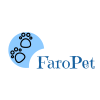

<head>
    <meta charset="utf-8">
</head>

<h1 align="center">
 
  
 
 
FaroPet 
</h1>

 O FaroPet é um projeto académico cujo os objetivos eram:

<ul>
    <li> construir uma base de dados em MySQL e alimentar com dados
    fictícios.</li> 
    <li>  Construir uma aplicação web em PHP, que possibilite aos usuários consultarem o trajeto de seus
    pets</li> 
    <li> Essa aplicação, deve ser capaz de apresentar uma página de consulta, contendo campos de configuração
    do período (Data), e ainda a seleção do pet </li> 
    <li>  O resultado desse processamento, deverá retornar uma página HTML com os seguintes
    elementos: </li> 
    <ol type='a'>
    <li >  Um mapa que apresente uma linha (Polyline) representando o trajeto do PET </li>
    </ol>
    
</ul>

