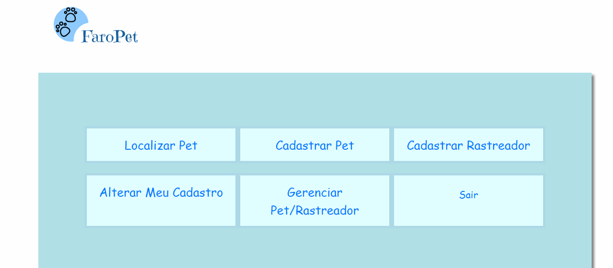

<head>
    <meta charset="utf-8">
</head>

<h1 align="center">
 
  
 
 
FaroPet 
</h1>

<h3> O FaroPet é um projeto académico cujo os objetivos eram:</h3>

<ul>
    <li> Construir uma base de dados em MySQL e alimentar com dados
    fictícios;</li> 
    <li>  Construir uma aplicação web em PHP, que possibilite aos usuários consultarem o trajeto de seus
    pets;</li> 
    <li> Essa aplicação, deve ser capaz de apresentar uma página de consulta, contendo campos de configuração
    do período (data), e ainda a seleção do pet;</li> 
    <li>  O resultado desse processamento, deverá retornar uma página HTML com os seguintes
    elementos: </li> 
    <ol>
      <li >  Uma tabela contendo todos os posicionamentos gerados pelo equipamento; </li>
      <li >  Um mapa que apresente uma linha (Polyline) representando o trajeto do PET. </li>
    </ol>  
</ul>

   <h3> Tela de login</h3> 
  
  

   <h3> Tela do histórico de localizaçao e do mapa  representando o trajeto do pet </h3>  
  
  

<h3> Principais tecnologias utilizadas</h3>

<ul>
    <li>PHP</li> 
    <li>MYSQL</li> 
    <li>API Bing Maps</li> 
    <li> Bootstrap 4</li> 
    <li> CSS 3</li> 
    <li> HTML 5</li> 

